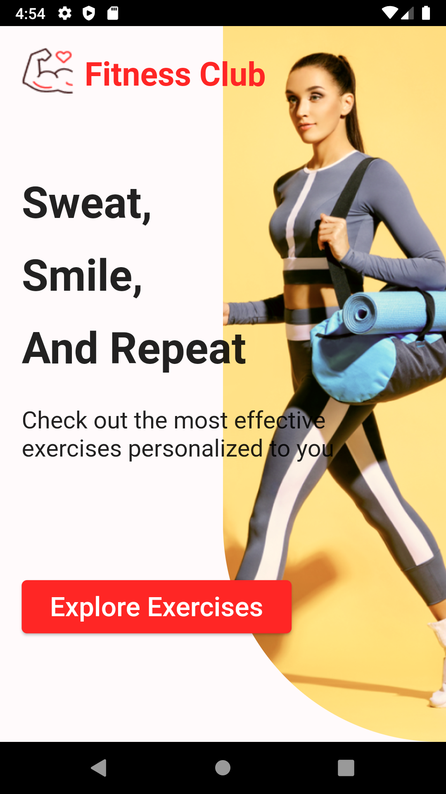
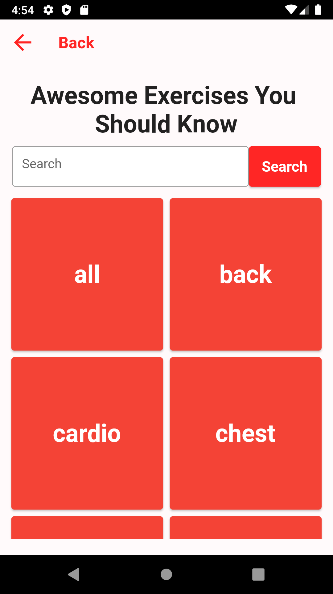
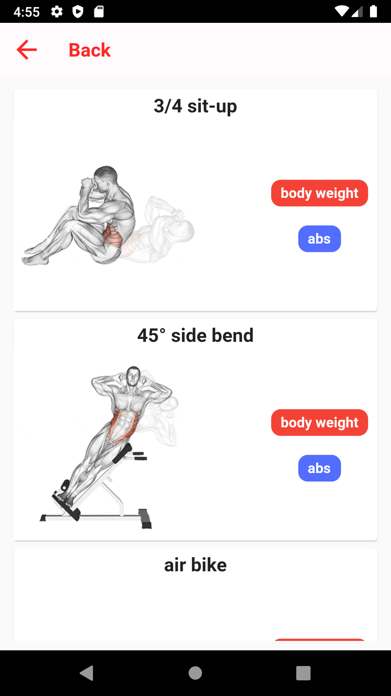
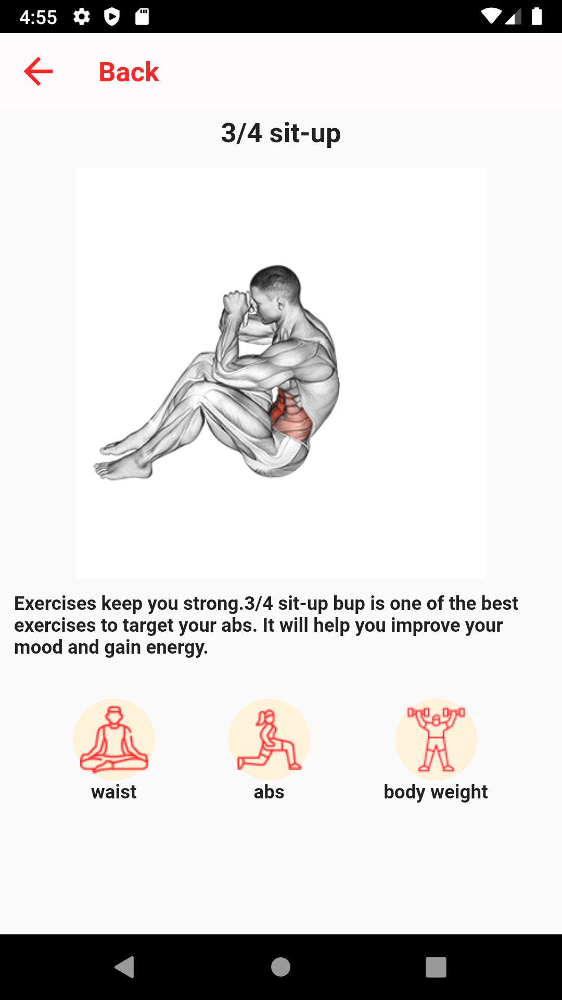

# 💪Fitness MobileApp

This Flutter project is a fitness application that allows users to search for exercises, apply filters, and view exercise details, including GIFs and descriptions.

## 🚀 Technologies Used

- Flutter
- Dart
- http package
- [RapidAPI](https://rapidapi.com/justin-WFnsXH_t6/api/exercisedb) 

## ⭐ Features

This app can do the following:

- **Exercise Search:** Users can search for exercises by name.
- **Exercise Filtering:** Users can filter exercises by category.
- **Exercise Details:** Each exercise comes with a description and a relevant GIF.

## 🏃 How to Run

1. Clone this repository: `git clone https://github.com/CenkMerk/Fitness-MobileApp.git`
2. Navigate to the project directory: `cd fitness-app`
3. Install the required dependencies: `flutter pub get`
4. To launch the app: `flutter run`

## 🤝  Contribution

If you'd like to contribute, please fork the repository and open a pull request. I'm open to fixes, features, and improvements anytime.

